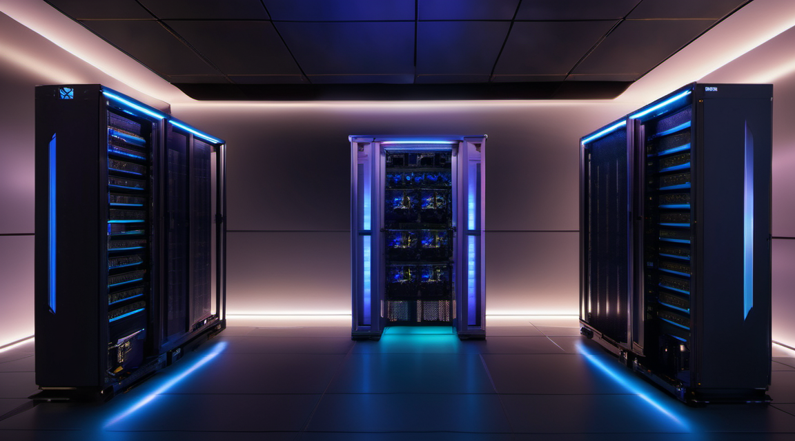

# Hardonia — Private, Local-First AI That Never Leaves Your Building

[](https://hardonia.store)
[](https://hardonia.store)
[](https://hardonia.store)
[](https://hardonia.store)
[](https://hardonia.store)
[](https://hardonia.store/products)
[](https://hardonia.store)

<!-- BEGIN: REPO HERO -->

<!-- END: REPO HERO -->

> **Run powerful AI on your own hardware. No data leaves the building. No
> per-seat SaaS tax. No vendor lock-in.** Hardonia is a private, local-first AI
> product studio and compute layer — from GPU inference APIs to compliance-grade
> drafting suites, every pipeline runs on infrastructure you control.

---

## Why Hardonia

- **Private by construction.** Your documents, models, and customer data never
  touch a third-party cloud. Ontario-hosted, on-prem, or fully air-gapped.
- **Sovereign, not rented.** Own the pipelines, the weights, and the runbooks.
- **Production-grade stack.** A multi-GPU fleet (Tesla V100 · P40 · RTX 3060)
  behind a routed Ollama + ComfyUI + LiteLLM layer, monitored 24/7.
- **Built by an operator, for operators.** Every product ships with the exact
  systemd units, health probes, and runbooks used in the live lab.

## Explore the Catalog

38 products across six families. Every link goes to the full kit, copy, and
assets.

### 🖥️ Compute & Inference
| Product | What it does | Pricing |
|---|---|---|
| [Hardonia Compute API Access](products/hardonia-compute-api-access/) | Private GPU compute, billed per job. API-key auth, rate-limited, no logs. | $20 starter · $99 pro · $299 enterprise |
| [Private Inference Access](products/private-inference-access/) | Private Ollama/ComfyUI access with API keys, Ontario-hosted. | contact |
| [Inference API Starter](products/inference-api-starter/) | Get a private inference endpoint running in an afternoon. | contact |
| [Inference API Scale](products/inference-api-scale/) | Multi-tenant, load-balanced private inference. | contact |
| [AI Box Doctor](products/ai-box-doctor/) | Self-healing diagnostics for your local AI box. | $99/mo |
| [GPU Spend Guard](products/gpu-spend-guard/) | Cap and alert on GPU spend before it runs away. | $19/mo |

### 🎨 ComfyUI & Image Generation
| Product | What it does | Pricing |
|---|---|---|
| [AI Portrait Studio](products/ai-portrait-studio/) | Private ComfyUI portraits — your refs, your GPU, your results. | $19–$49 |
| [ComfyUI Workflow Pack](products/comfyui-workflow-pack/) | Local-only workflow JSON + prompt presets. | — |
| [ComfyUI Workflow Subscription](products/comfyui-workflow-subscription/) | Fresh workflows, every month. | $29/mo |
| [ComfyUI Product Photo Kit](products/comfyui-product-photo-kit/) | Studio-quality product shots, locally generated. | — |
| [ComfyUI Fashion Lookbook Kit](products/comfyui-fashion-lookbook-kit/) | Editorial lookbooks on your hardware. | — |
| [ComfyUI Thumbnail Creator Kit](products/comfyui-thumbnail-creator-kit/) | Scroll-stopping thumbnails, fast. | — |
| [ComfyUI Node Starter Kit](products/comfyui-node-starter-kit/) | The node stack to bootstrap any workflow. | — |

### 🛡️ Sovereign & Compliance
| Product | What it does | Pricing |
|---|---|---|
| [Sovereign Control Plane](products/sovereign-control-plane/) | Multi-tenant fleet ops + compliance, on your metal. | $5,000/yr + $50/node/mo |
| [Sovereign Ops Score](products/sovereign-ops-score/) | Grade your AI ops posture monthly. | $29/mo |
| [Sovereign AI Audit](products/sovereign-ai-audit/) | Find sovereignty gaps before you buy. | $297 (credited) |
| [Sovereign Mission Intelligence](products/sovereign-mission-intelligence/) | Private decision support for regulated teams. | contact |
| [Sovereign Supercharger](products/sovereign-supercharger/) | The complete sovereign drafting suite. | contact |
| [Private AI Readiness Audit](products/private-ai-readiness/) | Is your stack ready for private AI? | $149/audit |
| [Private AI Assurance Retainer](products/private-ai-assurance-retainer/) | Recurring evidence + ops for AI SaaS teams. | contact |
| [Private AI Vault](products/private-ai-vault/) | Encrypted local store for AI assets. | contact |
| [Compliance Kit](products/compliance-kit/) | Policy + evidence templates for local AI. | contact |
| [Compliance Keep Current](products/compliance-keep-current/) | Keep compliance evidence fresh, automatically. | contact |
| [DepShield](products/depshield/) | Dependency vulnerability radar for AI repos. | — |

### 🤖 Agent & Ops Automation
| Product | What it does | Pricing |
|---|---|---|
| [Autonomous Revenue Loop](products/autonomous-revenue-loop/) | Your 60+ crons + catalog as a hands-off revenue OS. | $499–$2,500/mo |
| [Agent Ops Concierge](products/agent-ops-concierge/) | White-glove ops for agent fleets. | contact |
| [AI Change Ledger](products/ai-change-ledger/) | Private, recurring evidence layer for local AI. | — |
| [AI Lab Health Report](products/ai-lab-health-report/) | Sellable local-AI lab audit + monitoring pack. | — |
| [AI Lab Power Bundle](products/ai-lab-power-bundle/) | Three products, one checkout. | $59 bundle |
| [Local AI Ops Checklist](products/local-ai-ops-checklist/) | systemd templates, probes, and runbooks. | — |
| [n8n Automation Kit](products/n8n-automation-kit/) | Self-hosted n8n workflows + dashboard. | — |
| [Uptime Bond](products/uptime-bond/) | We bond your uptime with real SLAs. | contact |

### ✍️ Private Drafting Suites (On-Prem, Zero Cloud)
| Product | What it does | Pricing |
|---|---|---|
| [Hardonia Enterpriser](products/hardonia-enterpriser/) | 12 drafting pipelines, one license, zero cloud. | contact |
| [HRDraft](products/hr-draft/) | Local HR & policy drafting. | — |
| [LedgerDraft](products/ledger-draft/) | Local bookkeeping & financial letters. | — |
| [OpsDraft](products/ops-draft/) | Drafting for law firms & municipalities. | — |
| [Sentinel Note](products/sentinel-note/) | Local SOAP-note drafting for clinics. | — |
| [Legal](products/legal/) | Private legal drafting workspace. | — |

---

## The Stack Behind It

```
┌─────────────────────────────────────────────┐
│  Caddy reverse proxy  ·  auth  ·  rate-limit  │
├─────────────────────────────────────────────┤
│  Ollama GPU Router  (V100 · P40 · RTX3060)   │
│  ComfyUI (RTX3060)  ·  LiteLLM  ·  Open WebUI│
│  Hardonia Compute API  ·  Sovereign Control   │
├─────────────────────────────────────────────┤
│  local-first  ·  NVMe model store  ·  24/7     │
│  venv/python integrity guard  ·  auto-heal    │
└─────────────────────────────────────────────┘
```

Every service is watched by a self-healing guard that detects and repairs a
missing venv, a dangling `uv`, or an off-root runtime **before** it can crash —
so the catalog stays live without babysitting.

## Get Started

1. **Browse** the [products](products/) folder for the full kit, copy, and preview assets.
2. **Try** [Hardonia Compute API Access](products/hardonia-compute-api-access/) for private GPU jobs.
3. **Talk to us** about a [Private AI Readiness Audit](products/private-ai-readiness/) or a [Sovereign AI Audit](products/sovereign-ai-audit/).

---

<p align="center">
  <b>Hardonia</b> — private AI, sovereign by default.<br>
  <sub>Local-first digital product studio · Ontario-hosted · zero cloud dependency</sub>
</p>
